# hello_world

Nama : Aiska Oca Amalia
Kelas : SIB 2G
NIM : 244107060035

A new Flutter project.

Praktikum 1: Membuat Project Flutter Baru
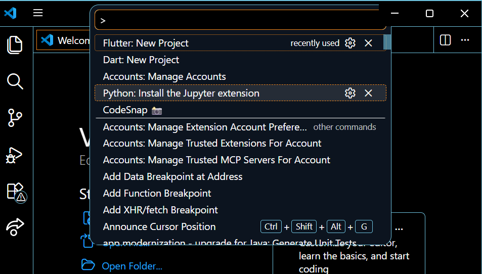
untuk langkah ini yang dilakukan adalah tekan tombol Ctrl + Shift + P maka akan tampil Command Palette, lalu ketik Flutter. Pilih New Application Project.
Langkah 2:
Kemudian buat folder sesuai style laporan praktikum yang Anda pilih. Disarankan pada folder dokumen atau desktop atau alamat folder lain yang tidak terlalu dalam atau panjang. Lalu pilih Select a folder to create the project in.
Langkah 3:
Buat nama project flutter hello_world seperti berikut, lalu tekan Enter. Tunggu hingga proses pembuatan project baru selesai.

project flutter berhasil di buat.

Praktikum 2: Menghubungkan Perangkat Android atau Emulator
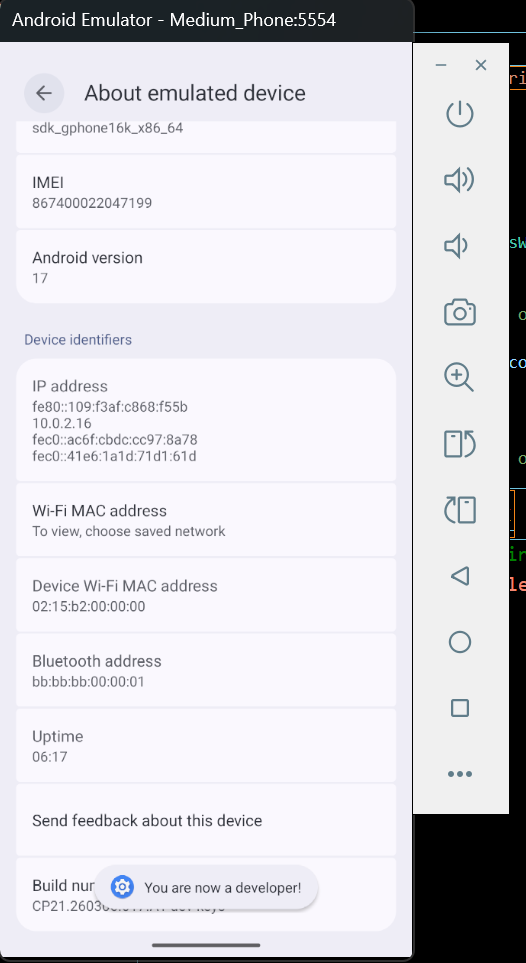
menekan build number sebanyak 7 kali hingga ada popup You are now a developer!.
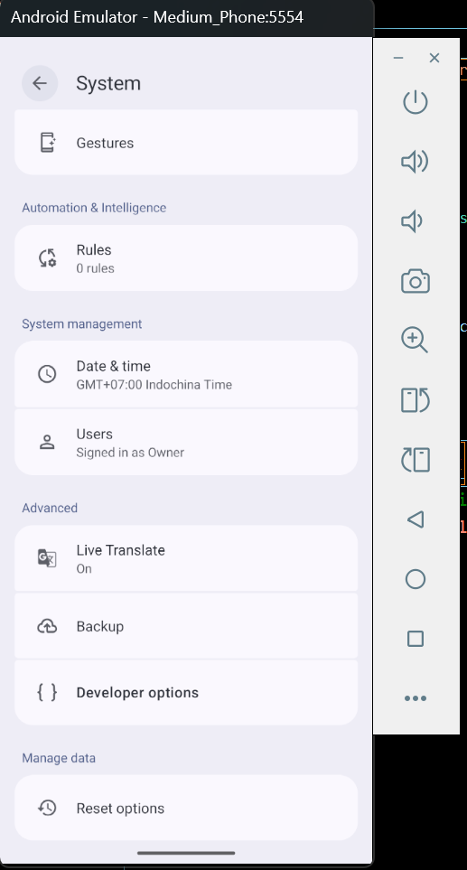

Praktikum 3: Membuat Repository GitHub dan Laporan Praktikum
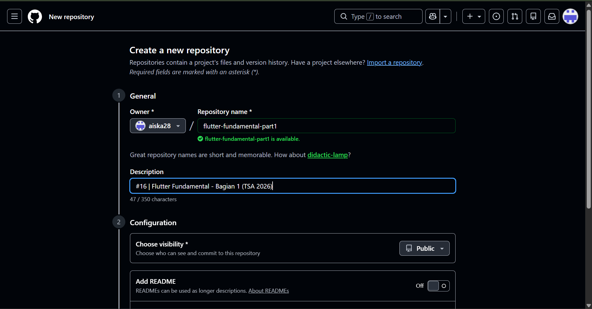
membuat repository baru, untuk praktikum ini
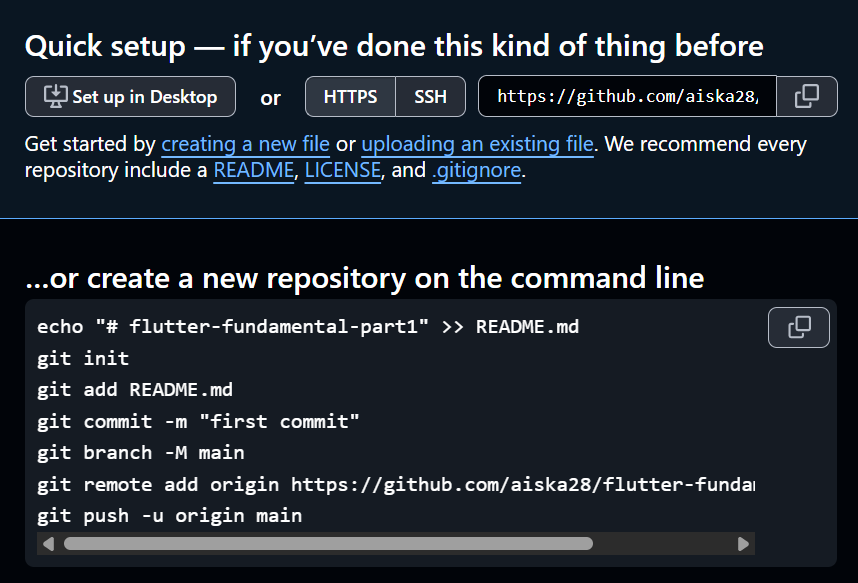
hasil ari membuat repository baru
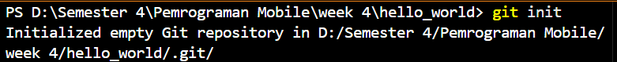
melakuakn "git init" pada vscoe yang digunakan untuk menginisialisasi repository git batu di dalam project ini.
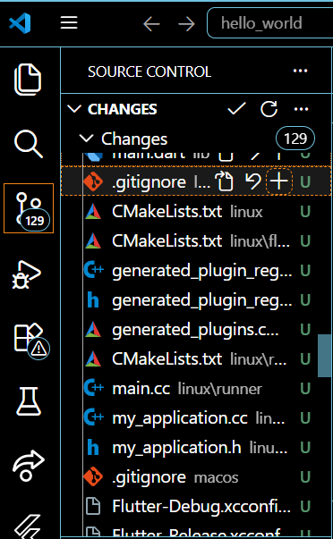
pada menu source control di lakukan stages pada file .gitignore untuk mengunggah file pertama ke dalam repository github.
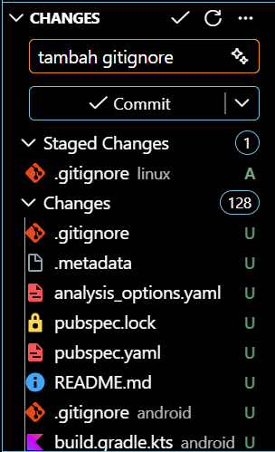
menambahkan comment "tambah gitignore" lalu klik commit
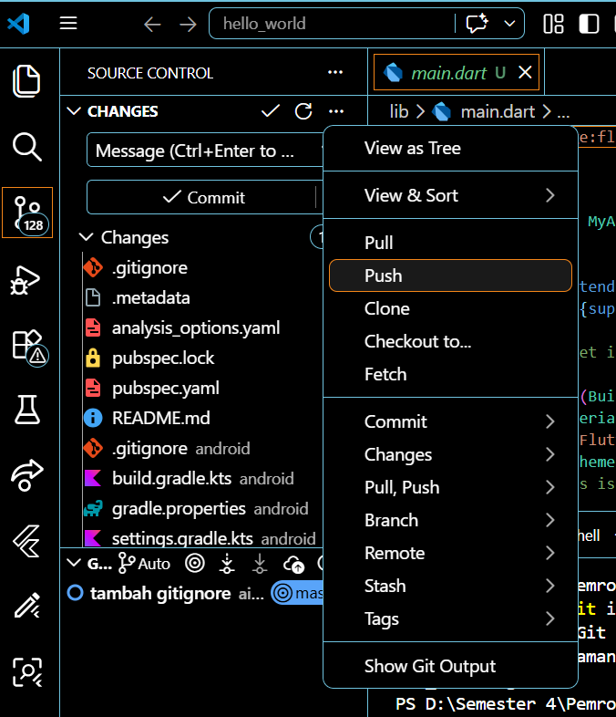
melakukan push
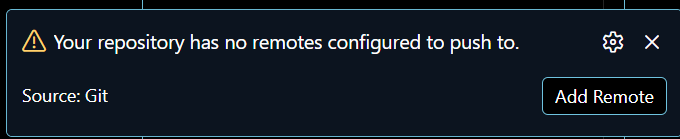
pada pojok kanan bawah terdapat popup lalu klik "aad remote"
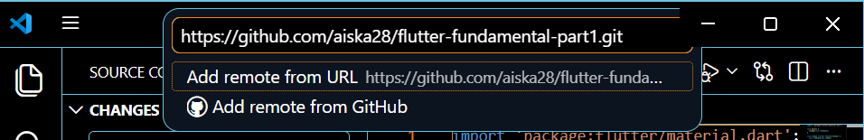
lalu menambahkan tautan repository dan klik add remote
.png)
setelah berhasil, tulis remote name dengan "origin"
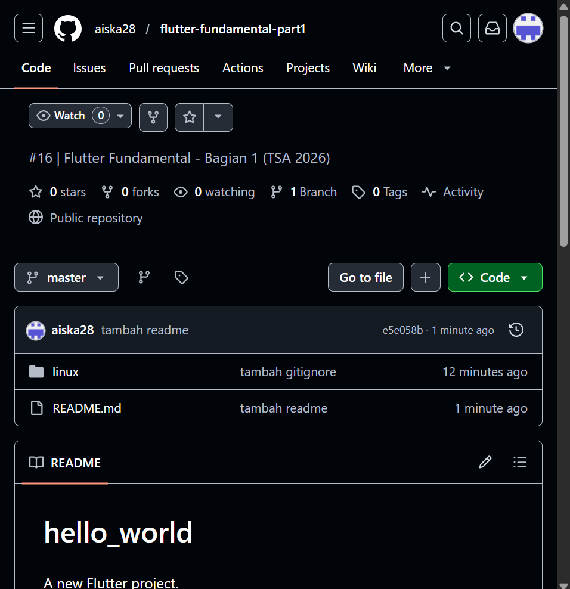
reloa halaman
.png)
tambah juga bagian readme
.png)
menambahkan readme
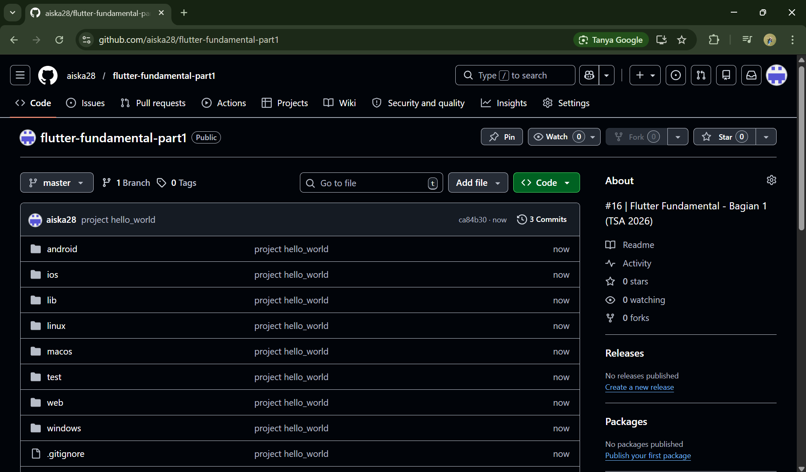
menambahkan semua fille dengan memilih stage all changes dan diberi pesan commit "project hello_world"
Langkah 11:
ubah platform di pojok kanan bawah ke emulator, lalu meakukan running pada project hello_world
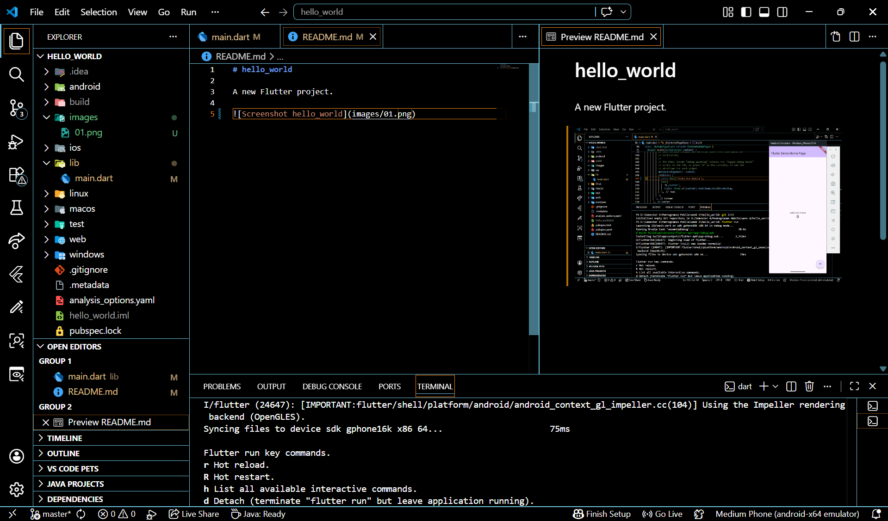
hasilnya

praktikum 4 dan 5
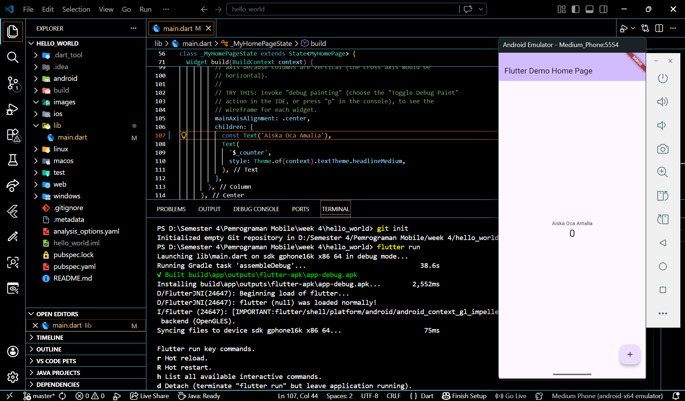
menampilkanhalaman yang berisi nama kita.
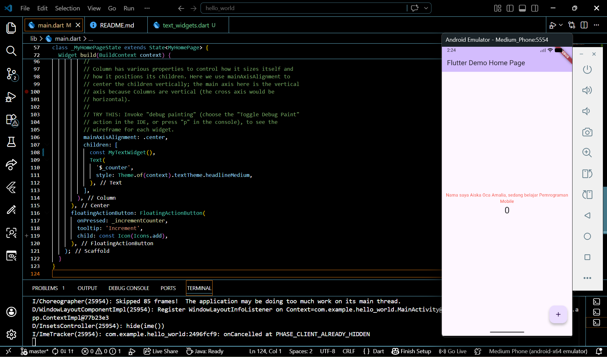
merubah flutter menjadi "nama saya Aiska Oca Amalia, saya sedang belajar pemrograman mobile.
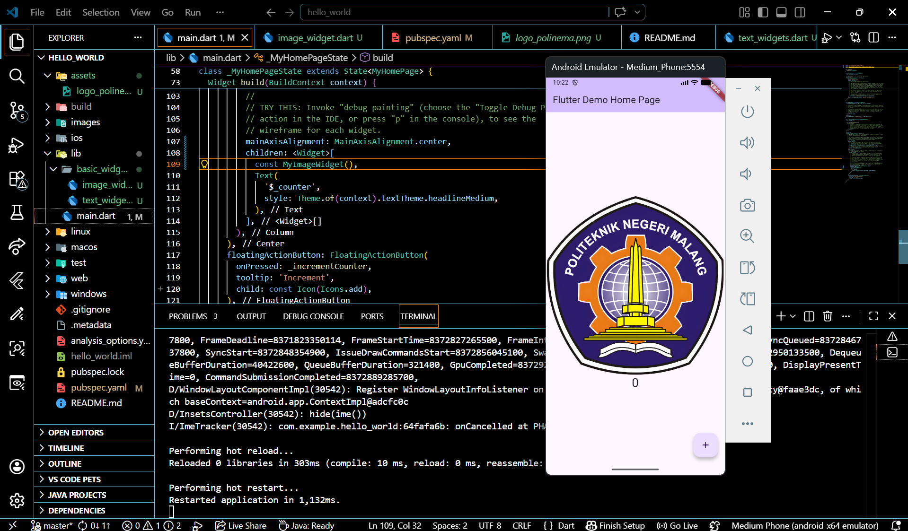
menghilangkan nama dan menambahkan logo polinema.
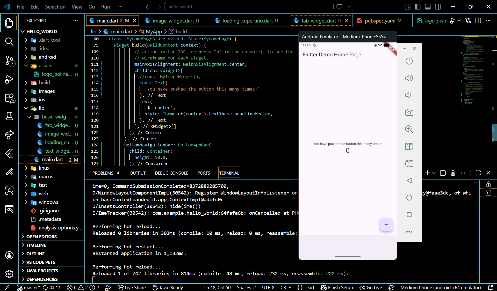
Cupertino Button adalah tombol dengan desain khas iOS yang memberikan tampilan lebih elegan dan minimalis. Sedangkan Loading Bar (seperti CupertinoActivityIndicator) digunakan untuk menampilkan proses loading atau menunggu, sehingga pengguna tahu bahwa aplikasi sedang memproses sesuatu.
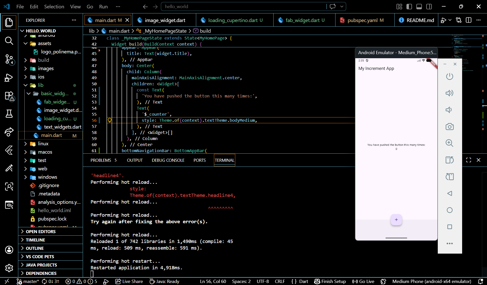
tombol yang digunakan untuk menampilkan aksi utama dalam aplikasi, seperti menambah data atau memnuat sesuatu yang baru.
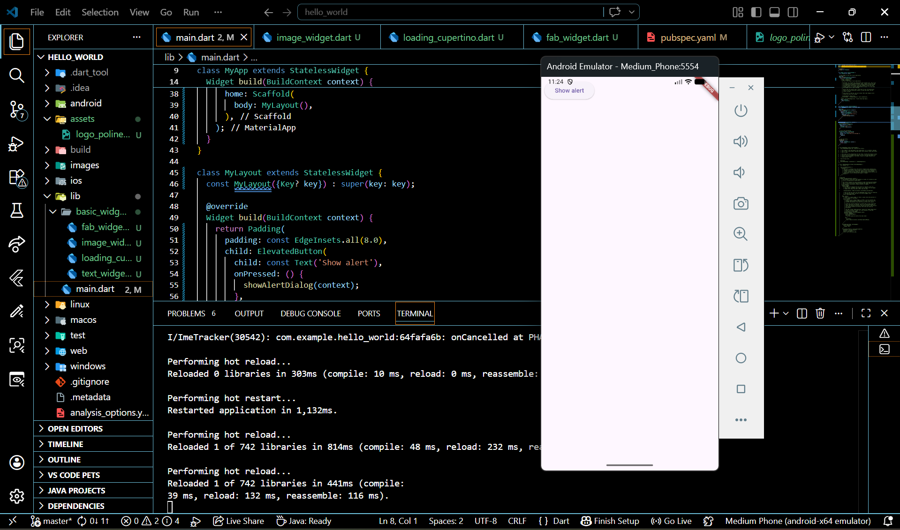
widget dasar yang digunakan untuk membangun struktur dalam aplikasi. widget ini menyediakan komponen penting seperti AppBar (header), body (isi), Drawer (menu samping), dan Floating Action Button.
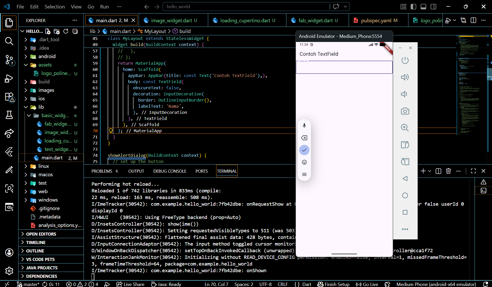
widget dasar digunakan untuk menampilkan pesan konfirmasi pada pengguna dalam bentuk pop up.

widget ini digunakan untuk menerima input ari pengguna , seperti TextField untuk mengetik teks, serta widget selection seperti checkbox, radio button, dan dropdown untuk memilih opsi tertentu.
.png)
pada wodegt ini digunakan untuk pengguna memilih tanggal dan waktu. biasanya digunakan dalam form atau aplikasi yang membutuhkan input seperti jadwal, deadline, atau pemesanan.
.png)
Flutter menyediakan fungsi seperti showDatePicker untuk memilih tanggal dan showTimePicker untuk memilih waktu. Widget ini akan menampilkan dialog khusus yang memudahkan pengguna dalam menentukan pilihan tanpa harus mengetik secara manual.

